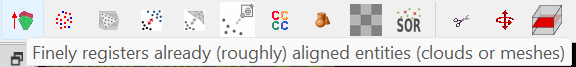
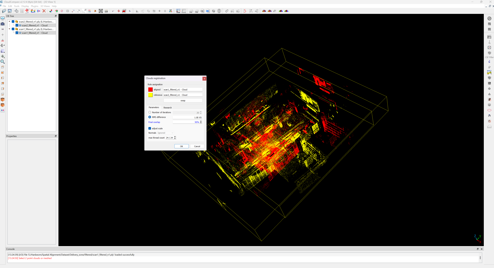
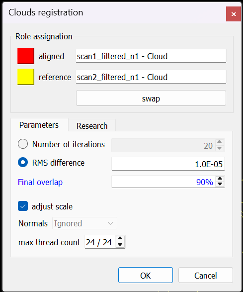

# **LiDAR-3DGS: LiDAR Reinforcement for Multimodal Initialization of 3D Gaussian Splats**

This repository contains scripts and configuration for capturing, calibrating, color-mapping LiDAR point clouds, and aligning them to an SfM model for 3D Gaussian Splatting.

**Abstract:**  
In this paper, we introduce LiDAR-3DGS, a novel approach for integrating LiDAR data into 3D Gaussian Splatting to enhance scene reconstructions. Rather than relying solely on image-based features, we integrate LiDAR-based features as initialization. To achieve this, we present a novel sampling technique – ChromaFilter – which prioritizes LiDAR points based on color diversity. It effectively samples important features while sparsifying redundant points. Experimental results on both a custom dataset and the ETH3D dataset show consistent improvements in PSNR and SSIM. A ChromaFilter sampling density of n=10 yields a notable 7.064% gain on PSNR and 0.564% gain on SSIM on the custom dataset, while ETH3D reconstructions exhibit an average PSNR increase of 4.915% and SSIM gain of 0.5951%. Our method provides practical solution for incorporating LiDAR data into 3DGS. Because many operational industrial robots are already equipped with both LiDAR and cameras, our method can be easily adopted to industrial robots to reconstruct more accurate 3DGS models for engineering and remote inspections.

---

## **Table of Contents**

1. [LiDAR Data Processing & Color Mapping](#lidar-data-processing--color-mapping)  
   1. [LiDAR–Camera Data Acquisition](#1-lidar–camera-data-acquisition)  
   2. [Extrinsic Calibration](#2-extrinsic-calibration)  
   3. [Color Mapping with R3LIVE](#3-color-mapping-with-r3live)  

2. [ChromaFilter](#chromafilter)  

3. [LiDAR–SfM Alignment](#lidar–sfm-alignment)  
   1. [Coarse Manual Alignment](#1-coarse-manual-alignment)  
   2. [Fine Registration via ICP](#2-fine-registration-via-icp)  

4. [LiDAR-3DGS-Training] (#additional-notes)
---

## **LiDAR Data Processing & Color Mapping**

To generate a dense, colorized LiDAR point cloud suitable for 3DGS training, we use a three‐stage pipeline.

### **1 LiDAR–Camera Data Acquisition**

**Hardware**  
- **LiDAR**: Ouster OS0-32  
  - 360° × 90° FOV; 32 channels; up to 655,360 pts/s @ 66 Mbps  
  - Range: 0.3 – 35 m; scan rate 10 – 20 Hz  
- **Camera**: FLIR Blackfly S (Sony IMX273)  
  - 1440 × 1080 px; up to 60 Hz; 70° FOV
- **GPU**: NVIDIA RTX 4080 (16GB)  

**Software**  
- Ubuntu 20.04 LTS  
- ROS Noetic  
  - Installation: <https://wiki.ros.org/noetic/Installation/Ubuntu>  

**Recording**  

`rosbag record /ouster/points /ouster/imu /flir/image_raw`  
  - /ouster/points      # sensor_msgs/PointCloud2  
  - /ouster/imu         # sensor_msgs/IMU  
  - /flir/image_raw     # sensor_msgs/Image  

### **2 Extrinsic Calibration**  
We estimate the 4×4 rigid‐body transform T between LiDAR and camera frames:
- **Guides**:  
  1. **Camera Intrinsics & LiDAR-camera Extrinsics**  
  Use ROS `camera_calibration` package and Koide’s `direct_visual_lidar_calibration` to estimate a 4 × 4 transform T.
  `camera_calibration`: https://wiki.ros.org/camera_calibration
  - **Camera Calibration**: To find intrinsic parameters including focal length (f_x, f_y), principle points (c_x, c_y), and distortion coefficients (k1, k2, p1, p2, k3)  
  **Camera Calibration Command**: We used 10x7 checkerboard with 50mm size of each box
    `rosrun camera_calibration cameracalibrator.py --size 10x7 --square 0.5 image:=/flir/image_raw`   
    Move the checkerboard in front of camera until **Calibration** button shows up. Moving the checkerboard side-by-side, tilting, and adjusting distance will help faster calibration. This step provides camera instrisic parameters.

  2. **LiDAR-Camera Extrinsics**  
  `direct_visual_lidar_calibration Repo`: https://github.com/koide3/direct_visual_lidar_calibration  
  This can be found in **LiDAR Processing** Folder  
  - **direct_visual_lidar_calibration Commands**:  
    1. **Recorded bag files in `ouster` folder**: Record `/ouster/points, /ouster/imu, /flir/image_raw` by moving the sensors up and down.  
    2. **Preprocessing**:`rosrun direct_visual_lidar_calibration preprocess ouster ouster_preprocessed -dv \ --camera_info_topic /flir_adk/camera_info \ --image_topic /flir_adk/image_raw \ --points_topic /ouster/points \ --camera_model plumb_bob \ --camera_intrinsic 1119.798146,1118.683090,740.720832,530.000662 \ --camera_distortion_coeffs -0.363603,0.131881,0.001062,-0.000594,0.000000`
    3. **Inital Manual Guess**: Manually select points in both LiDAR point cloud and images (at least 3 points)  `rosrun direct_visual_lidar_calibration initial_guess_manual ouster_preprocessed`
    4. **Calibration**: Automatically calibrate based on selected points `rosrun direct_visual_lidar_calibration calibrate ouster_preprocessed`
    5. **Fine Tuning**: Same calibration command to fine tune the calibration `rosrun direct_visual_lidar_calibration calibrate ouster_preprocessed`
    6. **Viewer**: View the calibrated result `rosrun direct_visual_lidar_calibration viewer ouster_preprocessed`
    7. **Visualize Sensors' Physical Position**: matrix calculator: https://staff.aist.go.jp/k.koide/workspace/matrix_converter/matrix_converter.html  
    3x3: rotation matrix --> needs inverse matrix  
    3x1: translation matrix

### **3 Color Mapping**
- **Guides**  
Use the R3LIVE module to project each time-synced, extrinsically aligned LiDAR point into its corresponding RGB camera frame. https://github.com/hku-mars/r3live
  1. **Prerequisites**
  `sudo apt-get install ros-XXX-cv-bridge ros-XXX-tf ros-XXX-message-filters ros-XXX-image-transport ros-XXX-image-transport*`  
  **livox_ros_driver**: https://github.com/Livox-SDK/livox_ros_driver  
  **OpenCV**: We utilized OpenCV 3.4.16  
  `git clone https://github.com/hku-mars/r3live.git`  
  Import `r3live` folder to your `/src/r3live` folder.

  2. **Recording**  
  Record LiDAR, camera, and IMU sensors' ros topic in ROSbag file.  
  `rosbag record /ouster/points /ouster/imu /flir/image_raw`

  3. **Finish Configuration**  
  In `src/r3live/config/r3live_config_ouster.yaml` file, insert camera intrinsic, and extrinsic parameters.

  4. **Run R3LIVE**  
  `roslaunch r3live r3live_bag_ouster.launch`

  5. **Playback ROSbag file**  
  `rosbag play [recorded bag file]`
---

## **ChromaFilter**  
**ChromaFilter: Color-Based LiDAR point cloud Subsampling**  
To further reduce redundant color information and focus on unique chromatic features, we implement a “ChromaFilter” that subsamples the point cloud by limiting the number of points per unique RGB value.

- **Guides**  
  **Prerequisites**  
  - Install Dependencies  
  `pip install numpy open3d`  
  - `max_points_per_color` = `1, 3, 5, 10, 20`  
    Control how many points you allow per unique RGB triplet when subsampling.
    - `Lower n` --> fewer points, stronger data reduction, faster downstream processing, but risk losing fine color-based detail
    - `Higher n` --> more color fidelity and spatial sampling at the cost of larger point clouds and slower processing
    - We recommend sampling between 1 to 5 points depending on density of your original LiDAR point cloud
  - Usage example:  
  `python3 ChromaFilter.py`
---

## **LiDAR–SfM Alignment**

To merge the dense `LiDAR point cloud` with a sparse `ChromaFiltered SfM reconstruction` (e.g., COLMAP), we use CloudCompare:

1. **Coarse Manual Alignment**  
   - Download/Install CloudCompare https://www.danielgm.net/cc/  
   - Load both point clouds into CloudCompare.  
   - Manually adjust `LiDAR point cloud`: scale, rotation, and translation until the major structures roughly overlap.

2. **Fine Registration via ICP**  
   - **Two-phase ICP**  
     1. **Phase 1**: Align major structures until ~ 90% overlap and `adjust scale = on`.  
     2. **Phase 2**: Refine to ~ 99% overlap and `adjust scale = off`.  
   - Click `Finely registers already (roughly) aligned entities (clouds or meshes)` button that utilize ICP method.
   
   
   
    - `Red aligned`: Data (LiDAR point cloud, will eventually move)
    - `Yellow reference`: Model (COLMAP SfM model, won't move) 
   - Output: A single, fused point cloud saved as a `.PLY` for 3DGS training.

---

## **LiDAR-3DGS Training**
1. Please install 3D Gaussian Splatting with https://github.com/graphdeco-inria/gaussian-splatting  
2. Then, paste all files in `3DGS_custom` folder to your `/gaussian-splatting`.  
3. After the .ply extracted from `LiDAR-SfM Alignment` stage, use `ply_to_colmap_txt.py` to convert cloudcompare ply file into COLMAP readable txt file.  
4. Paste it into `/gaussian-splatting/your_data/sparse/0/point3D.txt` after performing `convert.py` of your original image data.
5. Run `train_lidar.py` for training.
---
  
  
## **Additional Notes**  
  - `extract_best.py`: a keyframe extractor program that we have used for our custom dataset
  - `LiDARRandomSampling.py`: program we used for comparison with randomsampling and ChromaFilter  
  - Dataset used in study: https://www.eth3d.net/datasets 
  - For our custom dataset, we have included in `meiclablidar` folder. The pre-trained mnodel for this example is in `exampleoutput` folder we provided which can be checked through the SIBR viewer
  - LiDAR ply file + image dataset/video are required for your custom training
  - You can find our example Google Drive link in: https://drive.google.com/drive/folders/1m0OWiFNO1CpOMBa8FrSHZ8kzSDerXBo7?usp=sharing
